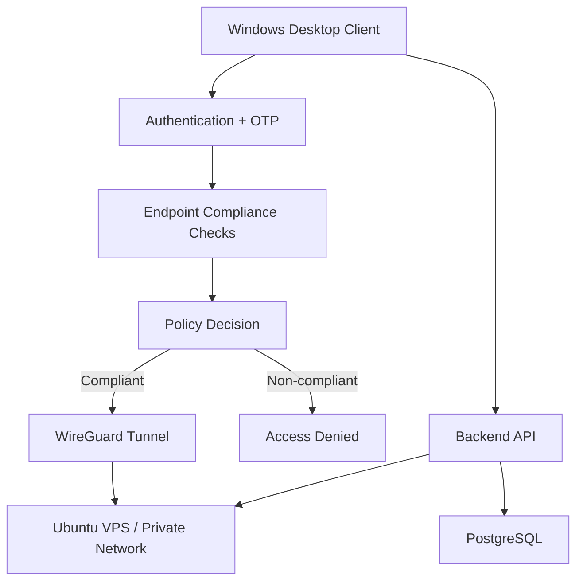

# CORPO VPN Architecture

## Trust Boundary

The client is treated as an untrusted endpoint. Identity and device posture are evaluated before network access is granted.

## Main Components

- Desktop client: authentication, endpoint checks, tunnel control.
- Backend API: identity/session handling and VPN peer provisioning.
- Database: application state and access metadata.
- Ubuntu/WireGuard server: encrypted tunnel termination and routing.

## Security Considerations

- VPN private keys must never be committed to source control.
- Production secrets must come from deployment-time secret storage.
- Endpoint compliance is a security signal, not a guarantee that a host is uncompromised.
- Administrative access should be protected with MFA and least privilege.
